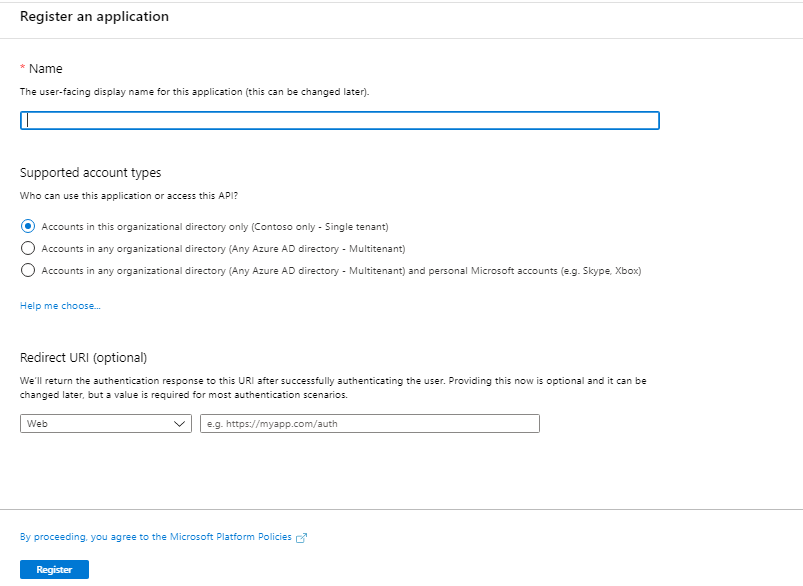
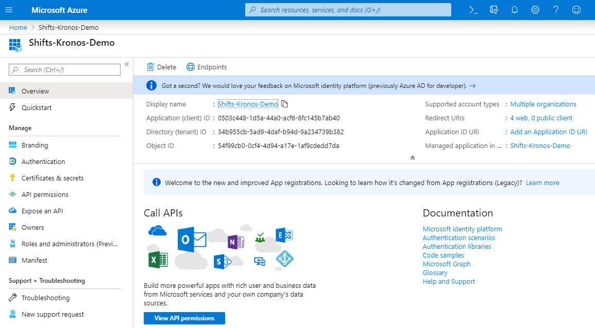
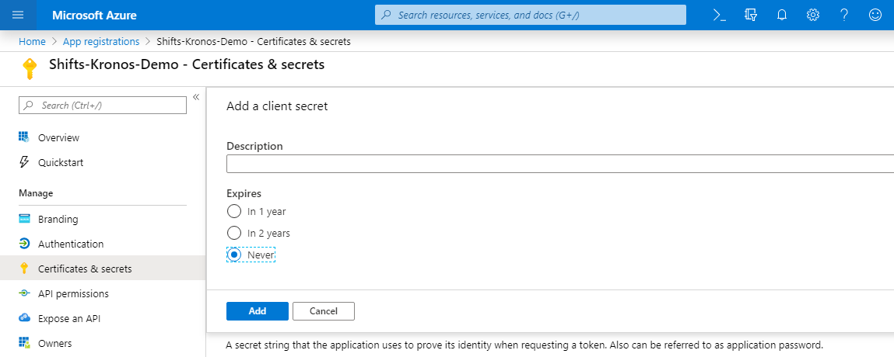
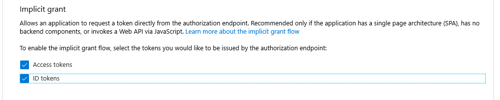

# Deployment Guide

## Overview
This document is created to help IT Administrators to deploy, configure, and use the **Shifts-Kronos Integration application** in a Microsoft Azure environment.  
**Kronos Workforce Central (Kronos WFC 8.1)** is a Workforce Management system designed for First Line Managers (FLMs) and First Line Workers (FLWs). Kronos provides various capabilities to handle schedules of FLWs in organizations with multiple dpeartments and job categories. First Line Workers can access their schedule, create schedule requests for Time-Offs, Open Shifts, Swap Shifts, etc.. FLMs can create, and access their FLWs' schedules, schedule requests and approve those.  
**Shifts App in Microsoft Teams** keeps FLWs connector and in sync. It's built mobile first for fast and effective time management and communication for teams. Shifts lets FLWs and FLMs use their mobile devices to manage schedules and keep in touch.  
**Shifts-Kronos Integration application** is built to sync data between Kronos Workforce Central (v8.1) and Microsoft Shifts App in Teams in seamless fashion. It helps FLWs access their schedules which are created in Kronos system from Shifts App, and further enables FLMs to access schedule requests which are created in Shifts from Kronos system.

## Considerations
The points noted below are to be considered as best practices to properly leverage the full potential of the Shifts-Kronos Integration application.

* IT Admin has functional understating of Kronos WFC 8.1 and Microsoft Teams Shifts App. IT Admin is also the super user of Kronos – The IT Admin needs to have admin-level access to Shifts as their credentials are required for request approval  
* Kronos WFC serves as single source of truth for all entities  
* Shifts App is used by FLWs to view their schedules, create requests for Time-Offs, Open-Shifts, Swap-Shifts  
* FLMs will use Kronos WFC only for all Approval/Rejection workflows  
* FLW requests (Open Shift Request, Swap Shift Request) will be sync’d from Shifts to Kronos in synchronous manner using Shifts Outbound APIs and Kronos WFC 8.1 data submission (POST) APIs  
* FLW requests for Time Off will be sync’d from Shifts to Kronos in asynchronous manner  
* Approved schedules for Shifts, Time-Offs, Open-Shifts and Swap-Shifts will be sync’d from Kronos to Shifts in asynchronous manner using Kronos WFC 8.1 GET APIs and Shifts/Graph post APIs  
* Status of requests created in Shifts App and synced to Kronos WFC will be synced back to Shifts to keep both systems in sync  
* To sync all the requests initiated in Shifts (by FLWs) to Kronos, SuperUser account credentials are used. Once these are approved in Kronos (by FLMs), their approval status will be synced back to Shifts. These statuses are synced to Shifts using Microsoft Graph APIs with Shifts Admin account authorization  
* Users must be created in Azure/Teams prior to User to User mapping step to be performed in Configuration Web App (Config Web App is one of the components of this integration as explained in below sections)  
* Teams and Scheduling groups must be created in Shifts prior Teams to Department mapping step in Configuration Web App  
* Done button on Configuration Web App should be used only for first time sync  
* First time sync is expected to take longer time since it may sync data for larger time interval. The time would vary based on amount of data i.e. number of users, number of teams, number of entities (such as Shifts, TimeOffs, OpenShifts etc.) to be synced and date span of the Time interval for which the sync is happening. So, it may take time to reflect this complete data in Shifts. Done button click will initiate background process to complete the sync  

## Solution Overview
The Shifts-Kronos Integration application has the following components built using ASP.Net Core 2.2. Those need to be hosted on Microsoft Azure.  
* Configuration Web App  
* Integration Service API  
* Azure Logic App for periodic data sync  
* Kronos WFC solution to retrieve data and post data, part of Integration Service API  

1.	Azure Web App Services – For Configuration Web App and the Integration Service API. The Configuration Web App and the Integration Service API are both written in ASP.NET Core technologies
2.	Azure Table Storage – the database account which contains the necessary tables required for the entire Shifts-Kronos Integration to work successfully
3.	Azure Logic App – this is the schedule job that will sync data between Kronos WFC and Shifts on a configured interval of time or configured number of previous days from current date till number of next days, based on flag passed to APIs for slide dates or complete sync
4.	Azure Key Vault – to store all the connection strings, client Ids, client secrets, access token for accessing graph API (All the data which requires encryption must be the part of key vault)
5.	Kronos Solution – This is custom library project which is the part of Integration Service API. It will be used to query and submit data to Kronos WFC
6.	Application Insights – Capture necessary telemetry at the time of necessary events, and will be used by both the Configuration Web App, the Integration Service API

## Deployment
Following section explains necessary steps to deploy Shifts-Kronos Integration application

### Prerequisites
To begin with, you will need to ensure following perequisites:

1. Kronos WFC 8.1 - Access to Kronos WFC 8.1 System with following details:  
* Kronos WFC endpoint
* SuperUser Name
* SuperUser password  
Review and ensure users, org levels and jobs are properly setup in Kronos system

2. Microsoft Teams Shifts App - Access to Teams Deployment with Shifts App
* Tenant ID
* Tenant Admin credentials  
Review and ensure AAD users, Teams, and Scheduling Groups are properly setup in Teams Shifts App  

3. Microsoft Azure environment to host Shifts-Kronos Integration App - An Azure subscription where you can create the following resources:  
* App services
* App service plan
* Azure Table storage account
* Azure Blob storage
* Azure Key Value
* Application Insights

### Register Azure AD Application
This integration app uses [Microsoft Graph APIs](https://developer.microsoft.com/en-us/graph) to access users (FLWs & FLMs) and teams and their schedules from Microsoft Teams Shifts App. To use Microsoft Graph to read and write resources on behalf of a user, this integration app needs to be registered in Azure AD by following steps below.  This is required to use Microsoft identity platform endpoint for authentication and authorization with Microsoft Graph.
1.	Log in to the Azure Portal for your subscription, and go to the "App registrations" blade here
2.	Click on "New registration” and create an Azure AD application
* **Name**: The name of your Teams app - if you are following the template for a default deployment, we recommend "Shifts-Kronos Integration"
* **Supported account types**: Select "Accounts in any organizational directory (Any Azure AD directory - Multitenant)"
* **Redirect URI based on ADAL / MSAL**: The URIs that will be accepted as destinations when returning authentication responses (tokens) after successfully authenticating users

**Figure 1.** Azure AD Application Registration

3. Click on the "Register" button
4. When the app is registered, you'll be taken to the app's "Overview" page. Copy the **Application (client) ID**; we will need it later. Verify that the "Supported account types" is set to **Multiple organizations**

**Figure 2.** Azure Application Registration Overview page.

5. On the side rail in the Manage section, navigate to the "Certificates & secrets" section. In the Client secrets section, click on "+ New client secret". Add a description (Name of the secret) for the secret and select “Never” for Expires. Click "Add"

6. Once the client secret is created, copy its Value; we will need it later
7. Navigate to the Authentication page that can be found in the left blade in Figure 3
8. Under the section that reads *Implicit grant*, make sure that the check boxes for Access tokens and ID tokens are checked. The screen should resemble something like the screenshot that follows:

At this point you have the following unique values:
* Application (client) ID
* Client secret
* Directory (Tenant) ID
* Managed Object ID

We recommend that you copy these values into a text file, using an application like Notepad. You will need these values later during the application deployment process.

### Microsoft Graph API Permissions
The table below outlines the required permissions necessary for the Azure AD application registration to successfully work end-to-end. These Graph API permissions should have their consent provided on the app registration:

**Table 1.** The list of Microsoft Graph API permissions.

|Scope|Application/Delegated|Function|
|-----|---------------------|--------|
|Group.Read.All|Delegated|Allows application to list groups and read properties and all group memberships on behalf of the signed-in user (tenant admin).|
|Group.ReadWrite.All|Delegated|Allows the application to create groups and read all group properties and memberships on behalf of the signed-in user (tenant admin).|
|WorkforceIntegration.Read.All|Delegated|Allows for workforce integrations to be retrieved from Microsoft Graph.|
|WorkforceIntegration.ReadWrite.All|Delegated|Allows for workforce integrations to be created and registered with Microsoft Graph.|
|offline_access|N/A|Enables for the Microsoft Graph token to be automatically refreshed|
|Schedule.Read.All|Application|Read all schedule items.|
|Schedule.ReadWrite.All|Application|Read and write all schedule items.|

## Deploy Application to your Azure Subscription
Here are the following requirements to correctly deploy the **Shifts-Kronos Integration** application to your Azure subscription: 
1. An ARM Template published as part of the Microsoft GitHub package.
2. Ensure to **properly** fork the main Microsoft repo to your account. This helps in three ways:
   1. The forked copy does not impate the master branch in the Microsoft repository
   2. Having a forked copy of the main repository, tenant admins can deploy from the forked repo
   3. If there are changes that are required for your organization, you can always modify the code in your forked copy and re-deploy
3. GitHub package containing the code for the Configuration Web App and the Integration Service API
4. You will be prompted to click on the *Deploy to Azure* button below, and when prompted log in to your Azure subscription

# Legal notice

Please read the license terms applicable to this [license](https://github.com/OfficeDev/Microsoft-Teams-Shifts-WFM-Connectors/blob/master/LICENSE). In addition to these terms, you agree to the following: 

* You are responsible for complying with all applicable privacy and security regulations, as well as all internal privacy and security policies of your company. You must also include your own privacy statement and terms of use for your app if you choose to deploy or share it broadly. 

* This template includes functionality to provide your company employees with HR information, and it is your responsibility to ensure the data is presented accurately. 

* Use and handling of any personal data collected by your app is your responsibility. Microsoft will not have any access to data collected through your app, and therefore is not responsible for any data related incidents.

# Contributing

This project welcomes contributions and suggestions. Most contributions require you to agree to a Contributor License Agreement (CLA) declaring that you have the right to, and actually do, grant us the rights to use your contribution. For details, visit https://cla.opensource.microsoft.com. 

When you submit a pull request, a CLA bot will automatically determine whether you need to provide a CLA and decorate the PR appropriately (e.g., status check, comment). Simply follow the instructions provided by the bot. You will only need to do this once across all repos using our CLA. 

This project has adopted the [Microsoft Open Source Code of Conduct](https://opensource.microsoft.com/codeofconduct/). For more information see the [Code of Conduct FAQ](https://opensource.microsoft.com/codeofconduct/faq/) or contact opencode@microsoft.com with any additional questions or comments. 

 