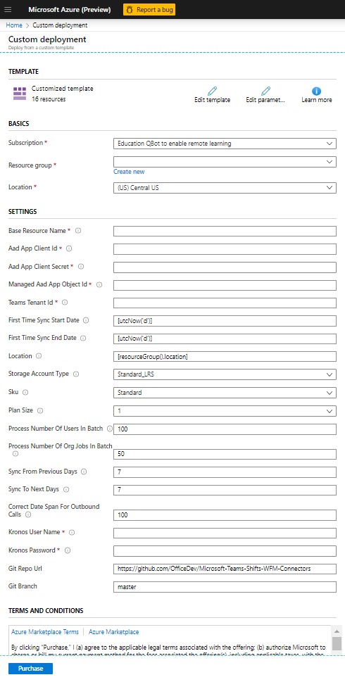

# Deployment Guide

## Overview
This document is created to help IT Administrators to deploy, configure, and use the **Shifts-Kronos Integration application** in a Microsoft Azure environment.  
**Kronos Workforce Central (Kronos WFC 8.1)** is a Workforce Management system designed for First Line Managers (FLMs) and First Line Workers (FLWs). Kronos provides various capabilities to handle schedules of FLWs in organizations with multiple dpeartments and job categories. First Line Workers can access their schedule, create schedule requests for Time-Offs, Open Shifts, Swap Shifts, etc.. FLMs can create, and access their FLWs' schedules, schedule requests and approve those.  
**Shifts App in Microsoft Teams** keeps FLWs connector and in sync. It's built mobile first for fast and effective time management and communication for teams. Shifts lets FLWs and FLMs use their mobile devices to manage schedules and keep in touch.  
**Shifts-Kronos Integration application** is built to sync data between Kronos Workforce Central (v8.1) and Microsoft Shifts App in Teams in seamless fashion. It helps FLWs access their schedules which are created in Kronos system from Shifts App, and further enables FLMs to access schedule requests which are created in Shifts from Kronos system.

## Considerations
The points noted below are to be considered as best practices to properly leverage the full potential of the Shifts-Kronos Integration application.

* IT Admin has functional understating of Kronos WFC 8.1 and Microsoft Teams Shifts App. IT Admin is also the super user of Kronos – The IT Admin needs to have admin-level access to Shifts as their credentials are required for request approval  
* Kronos WFC serves as single source of truth for all entities  
* Shifts App is used by FLWs to view their schedules, create requests for Time-Offs, Open-Shifts, Swap-Shifts  
* FLMs will use Kronos WFC only for all Approval/Rejection workflows  
* FLW requests (Open Shift Request, Swap Shift Request) will be sync’d from Shifts to Kronos in synchronous manner using Shifts Outbound APIs and Kronos WFC 8.1 data submission (POST) APIs  
* FLW requests for Time Off will be sync’d from Shifts to Kronos in asynchronous manner  
* Approved schedules for Shifts, Time-Offs, Open-Shifts and Swap-Shifts will be sync’d from Kronos to Shifts in asynchronous manner using Kronos WFC 8.1 GET APIs and Shifts/Graph post APIs  
* Status of requests created in Shifts App and synced to Kronos WFC will be synced back to Shifts to keep both systems in sync  
* To sync all the requests initiated in Shifts (by FLWs) to Kronos, SuperUser account credentials are used. Once these are approved in Kronos (by FLMs), their approval status will be synced back to Shifts. These statuses are synced to Shifts using Microsoft Graph APIs with Shifts Admin account authorization  
* Users must be created in Azure/Teams prior to User to User mapping step to be performed in Configuration Web App (Config Web App is one of the components of this integration as explained in below sections)  
* Teams and Scheduling groups must be created in Shifts prior Teams to Department mapping step in Configuration Web App  
* Done button on Configuration Web App should be used only for first time sync  
* First time sync is expected to take longer time since it may sync data for larger time interval. The time would vary based on amount of data i.e. number of users, number of teams, number of entities (such as Shifts, TimeOffs, OpenShifts etc.) to be synced and date span of the Time interval for which the sync is happening. So, it may take time to reflect this complete data in Shifts. Done button click will initiate background process to complete the sync  

## Solution Overview
The Shifts-Kronos Integration application has the following components built using ASP.Net Core 2.2. Those need to be hosted on Microsoft Azure.  
* Configuration Web App  
* Integration Service API  
* Azure Logic App for periodic data sync  
* Kronos WFC solution to retrieve data and post data, part of Integration Service API  

1.	Azure Web App Services – For Configuration Web App and the Integration Service API. The Configuration Web App and the Integration Service API are both written in ASP.NET Core technologies
2.	Azure Table Storage – the database account which contains the necessary tables required for the entire Shifts-Kronos Integration to work successfully
3.	Azure Logic App – this is the schedule job that will sync data between Kronos WFC and Shifts on a configured interval of time or configured number of previous days from current date till number of next days, based on flag passed to APIs for slide dates or complete sync
4.	Azure Key Vault – to store all the connection strings, client Ids, client secrets, access token for accessing graph API (All the data which requires encryption must be the part of key vault)
5.	Kronos Solution – This is custom library project which is the part of Integration Service API. It will be used to query and submit data to Kronos WFC
6.	Application Insights – Capture necessary telemetry at the time of necessary events, and will be used by both the Configuration Web App, the Integration Service API

## Deployment
Following section explains necessary steps to deploy Shifts-Kronos Integration application

### Prerequisites
To begin with, you will need to ensure following perequisites:

1. Kronos WFC 8.1 - Access to Kronos WFC 8.1 System with following details:  
* Kronos WFC endpoint
* SuperUser Name
* SuperUser password  
Review and ensure users, org levels and jobs are properly setup in Kronos system

2. Microsoft Teams Shifts App - Access to Teams Deployment with Shifts App
* Tenant ID
* Tenant Admin credentials  
Review and ensure AAD users, Teams, and Scheduling Groups are properly setup in Teams Shifts App  

3. Microsoft Azure environment to host Shifts-Kronos Integration App - An Azure subscription where you can create the following resources:  
* App services
* App service plan
* Azure Table storage account
* Azure Blob storage
* Azure Key Value
* Application Insights

### Register Azure AD Application
This integration app uses [Microsoft Graph APIs](https://developer.microsoft.com/en-us/graph) to access users (FLWs & FLMs) and teams and their schedules from Microsoft Teams Shifts App. To use Microsoft Graph to read and write resources on behalf of a user, this integration app needs to be registered in Azure AD by following steps below.  This is required to use Microsoft identity platform endpoint for authentication and authorization with Microsoft Graph.
1.	Log in to the Azure Portal for your subscription, and go to the "App registrations" blade here
2.	Click on "New registration” and create an Azure AD application
* **Name**: The name of your Teams app - if you are following the template for a default deployment, we recommend "Shifts-Kronos Integration"
* **Supported account types**: Select "Accounts in any organizational directory (Any Azure AD directory - Multitenant)"
* **Redirect URI based on ADAL / MSAL**: The URIs that will be accepted as destinations when returning authentication responses (tokens) after successfully authenticating users

**Figure 1.** Azure AD Application Registration

3. Click on the "Register" button
4. When the app is registered, you'll be taken to the app's "Overview" page. Copy the **Application (client) ID**; we will need it later. Verify that the "Supported account types" is set to **Multiple organizations**

**Figure 2.** Azure Application Registration Overview page.

5. On the side rail in the Manage section, navigate to the "Certificates & secrets" section. In the Client secrets section, click on "+ New client secret". Add a description (Name of the secret) for the secret and select “Never” for Expires. Click "Add"

6. Once the client secret is created, copy its Value; we will need it later
7. Navigate to the Authentication page that can be found in the left blade in Figure 3
8. Under the section that reads *Implicit grant*, make sure that the check boxes for Access tokens and ID tokens are checked. The screen should resemble something like the screenshot that follows:

At this point you have the following unique values:
* Application (client) ID
* Client secret
* Directory (Tenant) ID
* Managed Object ID

We recommend that you copy these values into a text file, using an application like Notepad. You will need these values later during the application deployment process.

### Microsoft Graph API Permissions
The table below outlines the required permissions necessary for the Azure AD application registration to successfully work end-to-end. These Graph API permissions should have their consent provided on the app registration:

**Table 1.** The list of Microsoft Graph API permissions.

|Scope|Application/Delegated|Function|
|-----|---------------------|--------|
|Group.Read.All|Delegated|Allows application to list groups and read properties and all group memberships on behalf of the signed-in user (tenant admin)|
|Group.ReadWrite.All|Delegated|Allows the application to create groups and read all group properties and memberships on behalf of the signed-in user (tenant admin)|
|WorkforceIntegration.Read.All|Delegated|Allows for workforce integrations to be retrieved from Microsoft Graph|
|WorkforceIntegration.ReadWrite.All|Delegated|Allows for workforce integrations to be created and registered with Microsoft Graph|
|offline_access|N/A|Enables for the Microsoft Graph token to be automatically refreshed|
|Schedule.Read.All|Application|Read all schedule items|
|Schedule.ReadWrite.All|Application|Read and write all schedule items|
|User.Read|Delegated|Sign in and read user profile|
|User.Read.All|Delegated|Read all users' full profiles|

## Deploy Application to your Azure Subscription
Here are the following requirements to correctly deploy the **Shifts-Kronos Integration** application to your Azure subscription: 
1. An ARM Template published as part of the Microsoft GitHub package.
2. Ensure to **properly** fork the main Microsoft repo to your account. This helps in three ways:
   1. The forked copy does not impate the master branch in the Microsoft repository
   2. Having a forked copy of the main repository, tenant admins can deploy from the forked repo
   3. If there are changes that are required for your organization, you can always modify the code in your forked copy and re-deploy
3. GitHub package containing the code for the Configuration Web App and the Integration Service API
4. You will be prompted to click on the *Deploy to Azure* button below, and when prompted log in to your Azure subscription

  
5. It will navigate to the form for filling the template parameters  
6. The figure below shows the form once the *Deploy to Azure* button is clicked

7. Select a subscription and a resource group - it is recommended to create a new resource group  
8. Fill in the values for the parameters of the ARM Template. They are defined in the table below:

**Table 2.** The ARM Template parameters
|Parameter Name|Description|
|--------------|-----------|
|baseResourceName|This is a standard name to be used across all resources|
|aadAppClientId|This is the Client ID from the app registration|
|aadAppClientSecret|This is the Client Secret from the app registration|
|managedAadAppObjectId|This is the AAD Object ID of the app registration|
|teamsTenantId|This is the Tenant ID of your Teams tenant, and it can be different than the tenant ID of the Azure sub where the Shifts-Kronos Integration package is deployed|
|firstTimeSyncStartDate|This is the start date of the first-time data sync between Kronos and Shifts|
|firstTimeSyncEndDate|This is the end date of the first-time data sync between Kronos and Shifts|
|Location|This is the data center for all the resources that will be deployed through the ARM Template. Make sure that you select a location that can host Application Insights, Azure Table Storage, Azure Key Vault, and Redis Cache|
|storageAccountType|This is the storage grade for the Azure table storage account|
|Sku|This is the payment tier of the various resources|
|planSize|The size of the hosting plan required for the API web app service and the Configuration Web App service|
|processNumberOfUsersInBatch|When syncing the shift entities between Kronos and Shifts, the transfer is done based on users in a batch manner. The default value is 100 and can be changed at the time of deployment|
|processNumberOfOrgJobsInBatch|When syncing the open shift entities between Kronos and Shifts, the transfer is done based on the org job paths in a batch manner. The default value is 50 and can be changed at the time of deployment|
|syncFromPreviousDays|The number of days in the past for subsequent syncs between Kronos and Shifts|
|syncToNextDays|The number of days in the future for subsequent syncs between Kronos and Shifts|
|gitRepoUrl|The public GitHub repository URL|
|gitBranch|The specific branch from which the code can be deployed. The recommended value is master, however, at the time of deployment this value can be changed|

8.	Agree to the Azure terms and conditions by clicking on the check box *I agree to the terms and conditions stated above* located at the bottom of the page
9.	Click on *Purchase* to start the deployment
10.	Wait for the deployment to finish. You can check the progress of the deployment from the *Notifications* pane of the Azure portal
11.	Once the deployment has finished, you would have the option to navigate to the resource group to ensure all resources are deployed correctly
12. Upon a successful deployment you would be presented with a screen that shows a large green check mark and a phrase similar to *Your deployment completed successfully*
13. Smoke test – this step is required to ensure that all the code has been properly deployed

## Post ARM Template Deployment Steps
The following actions are to be done post deployment to ensure that all the information is being exchanged correctly between the resources in the newly created resource group:
1.	Access Policy Setup in Azure Key Vault
2.	Setting up the Redirect URIs
3.	Logout URL setting in App Registration
4.	Uploading Excel files into Azure Blob storage
5.	User creation through the Teams Admin portal
6.	Establishing the necessary recurrence for the Azure Logic App

### Access Policy Setup in Azure Key Vault
Once the ARM Template deployment succeeds, it is important that you still add one more access policy to the Azure KeyVault resource. This time, the policy is to allow you as the Azure Administrator to properly monitor the Azure KeyVault. In order to setup your administrative access to the Azure KeyVault follow the steps below: 
1. Log on to the Azure portal
2. Navigate to the resource group that has been created as part of the ARM template deployment

**Figure 4.** Resource Group view.

3. Navigate inside of the KeyVault resource. You should search for an icon that has a key inside of a circle as shown in the screenshot in the previous step.

**Figure 5.** KeyVault resource.

4. Once you navigate to the KeyVault resource, on the left hand side in Figure 5, find an option that reads *Access policies*. This is where you will modify the access policies so that you as an admin can be able to change other access policies as required. Click on the option that reads *Access policies*. Your screen should resemble like something below:

**Figure 6.** Current Access policies on the Azure KeyVault.

5. The screen that you would see will definitely be different than the one shown here. However, you should still be able to see the option that reads *Add access policy*.  
6. Click on that link and you should be taken here:

**Figure 7.** Adding the Azure KeyVault access policy.

7. Follow the below instructions before clicking on the *Add* button in blue  
   * Under the label, *Configure from template (optional)* click the dropdown and you should see the following screenshot:

**Figure 8.** Selecting the template for setting the access policy.

   * Select the first value in the above screenshot.

8. Once you have selected the value that reads *Key, Secret, & Certificate Management*, the screen should resemble something like the following:

**Figure 9.** Selecting the template.

9. In the above figure, the next step is to select the principal. In this case, the principal is in fact your Azure admin account. Proceed further by clicking on the red star under the label that reads *Select principal*. There should be a rectangular window that opens to the right hand side.

**Figure 10.** Searching for a new principal.

10. In the text box on the right hand side of the screen, type your Azure admin account email.

**Figure 11.** Finding the Azure admin account.

11. From the screenshot above, make sure to select the account that matches the string that you input to search. *Note*: It is recommended to search using the email address as opposed to the name of the account.  
12. Once you have selected the account, your screen should resemble the below:

**Figure 12.** Account selection.

13. On the bottom right hand side of the screen, click on the button in blue that reads *Select*. Your screen should then look like this:

**Figure 13.** Before selecting the Add button.

14. Now click on the *Add* button, and you would be automatically redirected to the page which is shown in **Figure 6**. However, now you would see 4 access policies which would be similar to what is shown below:

**Figure 14.** All Azure KeyVault access policies are configured.

*Note*: There may be a difference in the names of the applications and the app registration. The main purpose is to ensure that there are a total of ***4*** access policies that are configured.

### Setting up the Redirect URIs
* Once the ARM Template deployment is successful, there would be an output screen that will show the necessary URL for the Configuration Web App service. Copy that URL into an application such as Notepad  
* Navigate to the App Registration created earlier  
* In Figure 2, click on the text next to the text that reads Redirect URIs  
* There is a chance that the screen may not have any redirect URIs. You would need to set those now. 

**Figure 15.** Redirect URIs being set already

* For any new app registrations, the redirect URIs may not be set
* You need to properly take the Configuration Web App service URL that is deployed as part of the ARM Template deployment and paste that URL here
* Subsequently, you need to add a new URL; paste that same URL that was copied from the outputs of the ARM Template deployment, and append “/signin-oidc”. By doing so, the tenant admin when logging into the Configuration Web App, will be authenticated using OpenIdConnect 
* Once all the changes are made, ensure to commit the changes through clicking on the button that reads Save

### Logout URL setting in App Registration
1.	Log on to the Azure portal
2.	Navigate to the application registration recently created (refer to the screenshots above)
3.	On the left-hand side, click on the option that reads Manifest
4.	In the code window that appears, scroll down until you read the JSON attribute: logoutUrl
Refer to the screenshot:

**Figure 16.** Application Registration Manifest window

5.	The value for the logoutUrl is the URL of the Configuration Web App service that was deployed through the ARM Template
6.	Copy and paste the URL from step 5 as the value for the logoutUrl
7.	Once the changes have been made, the save button at the top of the screenshot in step 4 will transition from a disabled state to an enabled state
8.	Click on the Save button to properly commit the changes made

### Uploading Excel Template files into Azure Blob Storage
Once the ARM Template deployment is successful, one final operation is to ensure that the Excel template files are uploaded to the Azure Blob storage that has been provisioned through the ARM Template. The steps below outline the procedure:

1.	Log onto the Azure portal, and sign in using your administrator credentials
2.	Navigate to the resource group that was created at the time of ARM Template deployment
3.	Navigate to the storage account that was created from the ARM Template deployment. The screen should resemble the figure below: 

**Figure 17.** Storage account overview

4.	Navigate into the containers, by clicking on the link that reads *Containers* from Figure 7 above
5.	Upon navigation to the containers, the ARM Template should provision a blob container called “templates”, and the screen should resemble below:

**Figure 19.** Templates blob container

6. Navigate inside of the "templates" blob container, and the screen should resemble the next screenshot below: 

**Figure 19.** Navigation inside of the "templates" blob.

User Creation through the Teams Admin Portal
1.    Navigate to the [Microsoft Teams Admin Portal](https://admin.teams.microsoft.com)
2.	Sign In with your AAD Tenant Admin credentials
3.	You will be presented with the following view once the sign in is successful:

**Figure 20.** Home page of the Teams Admin portal

4. From Figure 10, navigate to the Users page by clicking on the option that reads *Users* in the left hand blade. The screen should resemble the following below:

**Figure 21.** The users landing page

5. In the text above the table, there is a mention of "Admin center > Users". That is the location where you should go to add users to the tenant. Clicking on the "Admin center > Users" hyperlink in Figure 11 above should yield in the page below:

**Figure 22.** The page to add or remove users

### Setting up the Recurrence and Concurrency for the Azure Logic App
In this section you are going to set 2 aspects of the logic app: recurrence and the concurrency. The reason for setting the recurrence is to have a repeated occurrence of the data sync between Kronos WFC and Microsoft Shifts to happen on a specific interval of time. The reason for setting the concurrency is to prevent the logic app from running multiple times within a specific time window.

1.	Navigate to the resource group that has been create through the ARM Template Deployment
2. Click on the resource which has the text `-logicApp` appended at the end of the name. Your screen should resemble the following:

**Figure 23.** Logic app in resource group.

3. Navigate to the logic app, and you should be redirected to the following view:  
**Figure 24.** Logic app home page on the Azure portal.  

4. From the screenshot in the previous step, select on the *Edit* label. You should be able to find that label next to a pencil icon. Once you click that, you should then be redirected to a user interface that contains 1 step like the screenshot that follows:

**Figure 25.** Logic App Designer.

5. Here, you will search for *Recurrence*, as defined below. You will need to type in the text box where the text reads *Search connectors and triggers*.

**Figure 26.** Searching for recurrence.

6. Click on *Recurrence* as shown in **Figure 26**, and you would be shown a view like so:  
   
**Figure 27.** Populating the recurrence schedule for the logic app.

7. Next, provide a value for the interval and let the value of frequency be minute. It is recommended to provide the value of 15 such that the logic app will run 4 times within the span of 1 hour. Also, having 15 minute intervals allows for complete syncing of data.

**Figure 28.** Establishing the 15 minute intervals for the logic app.

8. Now, to set the concurrency - in the blue rectangle which reads *Recurrence*, click on the ellipses at the top right hand corner. See below:

**Figure 29.** Clicking on the ellipsis.

9. Next, click on the option that reads *Settings* (which can be seen in **Figure 29.**). You would be shown the following:

**Figure 30**. Establishing the concurrency.

10. Under the *Concurrency Control* subheader, there is a toggle button near the text that reads *Limit* and switch it from *Off* to *On*  

**Figure 31.** Turning on the concurrency control.

11. Finally, change the slider value from the above screenshot, from 25 to 1. This will then allow for having 1 run of the logic app to happen every 15 minutes.

**Figure 32.** Setting the value for the concurrency control.

12. From the above screenshot, click on the *Done* button, and at which point, in the top left corner, under the text that reads *Logic App Designer*, the *Save* button will also be enabled.
13. Click on the *Save* button to commit all the changes.

## Configuration App Workflow
The Configuration Web App serves as a helpful aid to establish the necessary configurations to properly integrate an instance of Kronos WFC v8.1 with Shifts app. It further helps to create mapping between Kronos and Shifts users as well as Kronos departments and Shifts teams.

### Step 1: Capture Kronos WFC Settings and register Shifts Workforce Integration
Access Config Web App. Sign in using your Azure AD Tenant Admin account. 
On successful sign-in you will see home page as shown below. Perform following steps on this page:
* Enter Kronos WFC endpoint, SuperUser name and password and click Submit button. It will validate and store the details in Azure storage
* Click Register link for Workforce Integration Registration, it registers application with Shifts Workforce Integration
By registering a Workforce Integration with Microsoft Graph, Shifts APIs can make real-time outbound calls when an FLW requests to take an Open Shift, or when two FLWs are requesting to Swap Shifts with each other. Without registering a Workforce Integration with Microsoft Graph, Shifts APIs will not make outbound calls, nor would any data be synced from Kronos WFC into Shifts.

**Figure 33.** Home page of the Configuration Web App

### Step 2: Kronos users to Shifts users mapping
You can access users mapping screen which will help you map users between Kronos and Shifts. Perform following steps on this page:
1.	Click Export button which downloads the kronos_shift_usermapping.xlsx file to your machine. The Excel file contains the following tabs:  
      1. “Kronos Users” tab contains KronosOrgJobPath, KronosPersonNumber, KronosUserName  
      2. "Shift Users" tab contains ShiftAADObjectId, ShiftUserDisplayName, ShiftUserPrincipalName
2.	Click on the Download Template button. It will download KronosShiftUserMappingTemplate.xlsx to your machine.
3.	Copy user details from kronos_shift_usermapping.xlsx to KronosShiftUserMappingTemplate.xlsx. Ensure user details from both Kronos and Shifts are mapped correctly in this file. Review and ensure the following:  
    1. All the columns are correctly populated 
    2. All users are correctly mapped
* It is a recommended tip that the display names of the users in AAD and in Kronos WFC are matching. For example, if a user in Kronos has their name formatted as LastName, FirstName (i.e. Benson, Sara), then the AAD name structure should be the same as well (i.e. Benson, Sara).
* No missing values
* No duplicate rows
4. When users have been successfully imported, the tenant admins can be able to delete a user mapping through click on the button that reads Delete in the event an erroneous mapping has been established. To re-establish the correct mapping, you can reimport the template and duplicate records will not be imported.

**Figure 34.** User to User Mapping Screen

### Step 3: Kronos departments to Shifts teams mapping
Access Kronos departments to Shifts teams mapping screen to map departments to teams:
1.	Click on the Export button. This action downloads the teams_department_usermapping.xlsx file on your machine which includes following details
      1. “Kronos Details” tab contains – KronosOrgJobPath, KronosWorkforceIntegrationId as below

**Figure 35.** Sample screenshot from the exported Kronos departments

   2. Need to create the shift teams and scheduling group using above path where second last value in each row is the team name and last value in each row is scheduling group name.

E.g. In below OrgJobPath **Frontend** will be a team name and **Cashier** will be the scheduling group name. Corporate/Grocery/Region 1/District 1/Store 0404/**Frontend/Cashier**.  Navigate to your [Teams instance](https://teams.microsoft.com/) and go to Teams tab, click on Join or create a team, and create a team with above specified name.

**Figure 36.** Screenshot for creating a team in Teams

3. Provide the name of the team

**Figure 37.** The Teams creation window

4. After successful team creation add the members in the team as per Kronos OrgJobPath  

**Figure 38.** User interface in Teams to add users to a team

5. Navigate to Shifts, app create the Schedule of the above created team as shown below:
   1. Log on to Microsoft Teams
   2. Navigate to the Shifts app as shown in the screenshot below:

**Figure 39.** The main UI in Teams, then logging into the Shifts app
  

3. Once you navigate into Shifts, you can view all the schedules for an entire team or create a new schedule for a team. The figure below shows the schedules that are available for teams that have already been created. To get to the screenshot in Figure 22, follow the steps below:  
   * In the Shifts app, if you are creating a schedule for a team for the first time, you would be presented with a screen that lists out all the teams in your Teams instance. The screenshot would be like the one below:

**Figure 40.** Creating a new schedule for a team

Note: If you have created teams and schedules before, make sure in Figure 22 below, make sure to scroll all the way to the bottom and click on the option that reads New schedule, there should be a plus icon there.

* Once you click on create from Figure 20, you will be presented with another screen that will enable you to set the time zone for the schedule

**Figure 41.** Setting the time zone for the schedule of the team

It is important to note that the time zone should be the same as the time zone of your Kronos WFC instance. This way when entities (i.e. Open Shifts, Time Off, Shifts) are synced, the start and end times are showing the same in both systems.

* After selecting the time zone and the closest city, proceed to click on the confirm button. You would be taken to a screen that looks like the screen grab in Figure 23.

**Figure 42.** Shifts user interface to view all the schedules  

**Figure 43.** Creating the scheduling groups in Shifts user interface

Also add the members of corresponding scheduling group by referring the user to user mapping Excel. E.g. Adams, Donald should be added to the Technician scheduling group under the Pharmacy team.

**Figure 44.** A Kronos User and the Org Job Path which identifies the user

Note: OrgJobPaths having same second last value are the same teams with different group name (Scheduling Group).  
g.	After creating all the teams, schedules and scheduling groups again download 
teams_department_usermapping.xlsx file on your machine which includes following details  
h.	“Kronos Details” tab contains – KronosOrgJobPath, KronosWorkforceIntegrationId  
i.	“Shift Team Details” tab contains - ShiftTeamId, ShiftTeamDisplayName, SchedulingGroupId, SchedulingGroupDisplayName

2. Click on *Download Template* button. This action downloads the KronosShiftTeamDeptMappingTemplate.xlsx
3.	Copy the details from teams_department_usermapping.xlsx file to KronosShiftTeamDeptMappingTemplate.xlsx. Ensure details from both Kronos and Shifts are mapped correctly in this file. Review and ensure following:  
a.	All the columns are correctly populated   
b.	All values are correctly mapped  
c.	No missing values  
d.	No duplicate rows
 
Note: If a team has not been mapped (i.e. Meatpacking team), and the users under the Meatpacking team have been mapped, the data in Kronos WFC for the Meatpacking department will not be synced to the Meatpacking team on Shifts. In other words, those users will be skipped during the sync operations.

**Figure 45.** Teams to Department Mapping screen

### Step 4: Perform first time sync
Click on the Done button in Team to Department Mapping screen, which will initiate following workflows:  
a.	Kronos to Shifts – Open Shift sync  
b.	Kronos to Shifts – Approved or Declined Open Shift Request sync  
c.	Kronos to Shifts – Approved Swap Shift Request sync  
d.	Kronos to Shifts – Time Off Reason sync  
e.	Kronos to Shifts – Approved or Declined Time Off Sync  
f.	Shifts to Kronos – Time Off Request sync  
g.	Kronos to Shifts – Shifts sync

**Figure 46.** Team to Department Mapping screen with Done button

The first-time sync will be done using the parameters of *firstTimeSyncStartDate* and *firstTimeSyncEndDate* which have been defined in **Table 2**: ARM Template parameters. These are the dates that the Configuration Web App will sync the data from Kronos into Shifts. Subsequent data sync operations are handled through the logic app, and explained in the following section: *Data Sync through Logic App*. 

# Data Sync through Logic App
The ARM Template provisions the Azure logic app, and the Azure logic app will execute based upon the sync frequency, sync interval, and sync hour chosen by the tenant admin. There are couple key differences to note between syncing data via the done button, and syncing the data via the Azure logic app. When the logic app is triggered on a scheduled interval, the time period for syncing data will be automatically calculated using the parameters syncFromPreviousDays and syncToNextDays from config file which represent the number of days in the past, and the number of days in the future respectively. The point of reference for the calculations will be based on the current date at which the logic app is executing.
FLW requests (Open Shift Request, Swap Shift Request) will be sync’d from Shifts to Kronos in synchronous manner using Shifts Outbound APIs and Kronos WFC 8.1 data submission (POST) APIs (logic app does not play any role in this sync)

# Telemetry
Shifts-Kronos Integration application utilizes Azure Application Insights to capture the necessary events and errors. It captures following properties:
* Response from Kronos and Graph APIs – capturing necessary Id values.
  * Success
  * Errors
* Events (sync from Kronos to Shifts, real-time outbound from Shifts to Kronos)
  * Method names
    * Parameters passed to methods
  * Timestamps (at the time when events happen)  
* Data properties (i.e. any IDs that are of interest to Graph API calls, or local data retrieval)  
* Tenant ID – where applicable  
* Outbound calls from Shifts to the Integration API Service

# Troubleshooting
The following are common issues that tenant admins may encounter while following these steps to deploy the Shifts-Kronos Integration application:
* Problems while deploying to Azure

|Issue|Solution|
|-----|--------|
|Duplicate resource names|Ensure that at the time of deployment, the necessary resources have unique names.|

* Problems while using Configuration Web App, or logic app (data does not sync, most likely due to Graph token expiration)

|Issue|Solution|
|-----|--------|
|Graph token expiration - 401 Unauthorized|The Graph token may experie, and to resolve that: 1. Log out of the configuration web app. 2. Log back into the configuration web app.|

* Problems while creating open shifts

|Error|Reason|
|-----|------|
|Sorry your change couldn't be completed|Above scenario may happen due to Kronos business rules: Ex: the number of working hours for the user should not be more than 40 hours for current week otherwise Kronos does not allow to create / submit the open shift request. If such request is initiated, the Workforce Integration sends error to Shifts and Shifts would not allow to submit such open shift request  **Solution:** FLW to choose and submit open shift requests after ensuring number of working hours quota for given duration|

* Problem while creating swap shifts

|Error|Reason|
|-----|------|
|Sorry your change couldn't be completed|Swap shift request creation/submission success depends upon business rules on Kronos side so FLWs need to be aware of those before requesting Swap 1. Swap shift is not possible for past date in Shifts. If such request is initiated from Shifts, the Workforce Integration sends error to Shifts. Shifts will display a generic error message 2. Swap shift is not allowed in Kronos if user already has same shift as the requested shift. The Workforce Integration sends error to Shifts. Shifts will display a generic error message. 3. If User1 has requested User2 for a swap shift and user2 has requested the same shift to User 3, then one of the requests will get approved and other will be declined|

# Best Practices
The following tips are recommended as best practices when it comes to deploying the Shifts-Kronos Integration package from GitHub:
1.	One instance of Kronos WFC corresponds to one instance of Teams
2.	Fork the main Microsoft repo for the following reasons:  
    * Any custom changes that are required, can be made on the forked copy of the Microsoft repository  
    * Easy to deploy changes from the forked copy of the Microsoft repo on to Azure subscription

# Legal notice

Please read the license terms applicable to this [license](https://github.com/OfficeDev/Microsoft-Teams-Shifts-WFM-Connectors/blob/master/LICENSE). In addition to these terms, you agree to the following: 

* You are responsible for complying with all applicable privacy and security regulations, as well as all internal privacy and security policies of your company. You must also include your own privacy statement and terms of use for your app if you choose to deploy or share it broadly. 

* This template includes functionality to provide your company employees with HR information, and it is your responsibility to ensure the data is presented accurately. 

* Use and handling of any personal data collected by your app is your responsibility. Microsoft will not have any access to data collected through your app, and therefore is not responsible for any data related incidents.

# Contributing

This project welcomes contributions and suggestions. Most contributions require you to agree to a Contributor License Agreement (CLA) declaring that you have the right to, and actually do, grant us the rights to use your contribution. For details, visit https://cla.opensource.microsoft.com. 

When you submit a pull request, a CLA bot will automatically determine whether you need to provide a CLA and decorate the PR appropriately (e.g., status check, comment). Simply follow the instructions provided by the bot. You will only need to do this once across all repos using our CLA. 

This project has adopted the [Microsoft Open Source Code of Conduct](https://opensource.microsoft.com/codeofconduct/). For more information see the [Code of Conduct FAQ](https://opensource.microsoft.com/codeofconduct/faq/) or contact opencode@microsoft.com with any additional questions or comments. 

 
