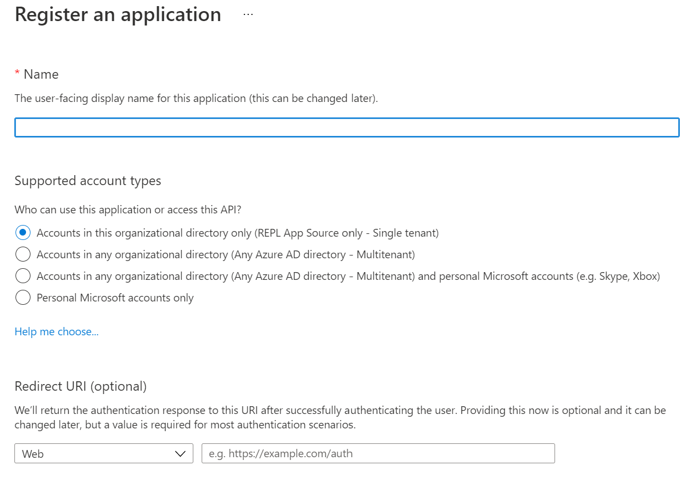
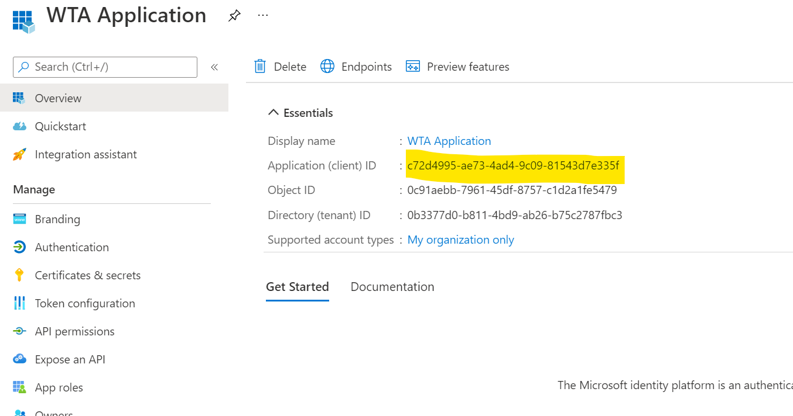
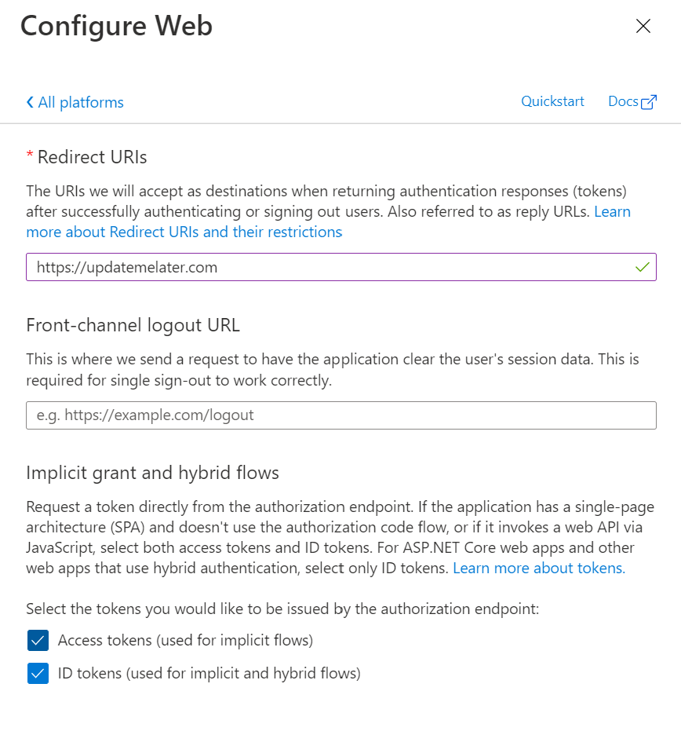
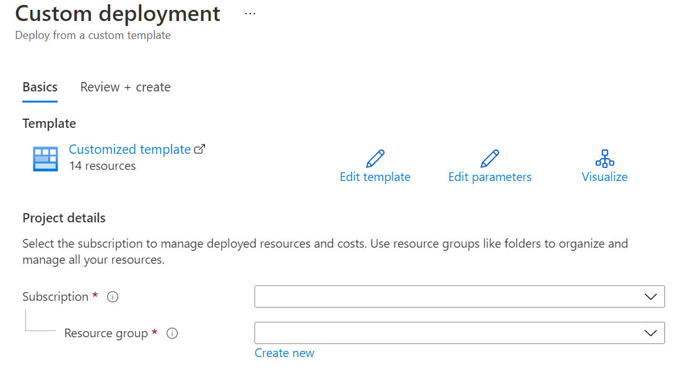

# Azure Infrastructure Deployment Guide

## Overview

This document has been created to help IT Administrators deploy the necessary infrastructure to an Azure Resource Group using the supplied Azure Resource Manager (ARM) template.

## Prerequisites

The points noted below are the minimal requirements in order to be able to properly deploy and configure the WFM Teams Adapter application with specifics for the Blue Yonder WFM Connector (other WFM providers may have different requirements):

* The IT Admin has a functional understating of Blue Yonder WFM 2020.3+, Microsoft Azure and the Microsoft Teams Shifts App.
* The IT Admin is a tenant admin in the Microsoft Azure tenant where the solution is to be deployed. This level of permission is required for the following activities:
  * Create and configure an App Registration in Active Directory
  * Grant Admin consent for application permissions for the App Registration
  * Deploy the resources to the Resource Group in Azure
  * Configure the Azure KeyVault
* A super-user account has been created in Blue Yonder at the root enterprise level that has the following roles: RWA API Access (required for the retail web api) and Store Manager (required for the site manager api).
* Users must be created in Azure Active Directory manually prior to connecting any team and must be given a user principal name (upn) that can be automatically mapped to the login name of the user in Blue Yonder. User to user mapping is controlled by a configuration app setting in the Functions App in Azure UserPrincipalNameFormatString. This setting is a comma delimited list of upn's where {0} represents the part of the upn that must correspond to the login name in Blue Yonder. Thus a user with the Blue Yonder login name john.doe must have a Teams upn of john.doe@somedomain.com and the UserPrincipalNameFormatString should be set to to {0}@somedomain.com.  
* Teams must be created before they can be connected to the integration. 
  * Only users that have been added to the team and that can be successfully mapped will have their schedule synced across.
  * Users can be added to the team at any time.
  * Users should only be removed from a team after all their current and future shifts have been deleted/reassigned in Blue Yonder and these shift changes have synced across to the Teams Shifts app.
* All time zones configured in Blue Yonder need to be manually added to the timezones Azure Storage table (details below). 

## Register Azure AD Application

This integration uses the Microsoft Graph APIs to access information about users (FLWs & FLMs), teams and schedules from the Microsoft Teams Shifts App. In order to be able to do this, the application must be registered in Azure AD and the required permissions need to be granted.

1. Log in to the Azure Portal and navigate to Azure Active Directory and select **App registrations**.
2. Click on **+ New Registration** and:
   - **Name**: supply a name e.g. Shifts-Blue Yonder Integration
   - **Supported account type**: normally the default of single tenant should be sufficient
   - **Redirect URI**: this is important but will be set after deployment of the ARM template and the functions application

3. Click on the Register button.
4. When the app is registered, you'll be taken to the app's "Overview" page. Copy the **Application (client) ID**; we will need it later.

5. In the side panel in the Manage section, click the **Certificates & secrets** section. In the Client secrets section, click on **+ New client secret**. Add a description (name of the secret) and select *Recommended: 6 months* for Expires (don't forget to set a reminder to create a new secret and update the value in KeyVault near the expiry date otherwise the application will simply stop working) and click **Add**.
6. Copy the secret value because it will be needed later and this is the one and only time the secret will be visible.
7. Navigate to the **Authentication** page that can be found in the left panel under *Manage* in the figure under step 4.
8. Click **+ Add a platform** and select Web and enter the required value for *Redirect URIs* which can be anything for now as it will be updated later and select **Access tokens** and **ID tokens** under *Implicit grant* 

9. Click the Configure button.
10. Next click API permissions in the left panel and select the following permissions:

| Scope                              | Application/Delegated | Description                                                  |
| ---------------------------------- | --------------------- | ------------------------------------------------------------ |
| User.Read.All                      | Application           | Allows the application to read the full profile for users    |
| Group.Read.All                     | Application           | Allows the application to read all group (team) data, specifically it allows the application to obtain team and membership data. |
| Schedule.ReadWriteAll              | Application           | Allows the application to create/update a schedule (and all the items within it) for the Team. |
| UserShiftPreferences.ReadWrite.All | Application           | Allows the application to read and write the shift preferences (availability) for the team members. |

11. Click the Grant admin consent for... option to grant the required consent to the Application.

## Deploy The Application Infrastructure To Microsoft Azure

The src folder contains a WfmTeams.Adapter.Infrastructure project which contains the Azure Resource Manager (ARM) template that will create all the required resources for the application in a single resource group.

1. Open this file (AzureInfrastructureDeploymentGuide.md) in **your** GitHub repo and edit the url of the Deploy to Azure button below to refer to your own forked repo e.g. change *OfficeDev* to the name of your repo.

  

3. After saving the change, reopen this file from your repo and click the button to start the deployment process which will display the following screen:

4. Select the subscription that you wish to deploy to and an existing resource group, or create a new one and then provide values for the following template parameters:

| Parameter Name                           | Required | Description                                                  |
| ---------------------------------------- | :------: | ------------------------------------------------------------ |
| Region                                   |   Yes    | Select the region to create the resources in. This should normally be the same region as the subscription and resource group. |
| Application Insights Name                |    No    | If not supplied the application insights instance will be created with the name {ResourceGroupName}ain. |
| Application Storage Account Name         |    No    | If not supplied the application storage account will be created with the name {ResourceGroupName}aps. |
| App Service Plan Name                    |    No    | If not supplied the application storage account will be created with the name {ResourceGroupName}pln. |
| Availability Frequency Minutes           |   Yes    | The frequency (in minutes) the WFM provider will be polled for changes to user availability and updated in Shifts. |
| Blue Yonder Base Address                 |   Yes*   | The base API address. Typically for a SAAS deployment in the BY Cloud this should look something like https://{client}-wfm-eai-{env}.jdadelivers.com |
| Clear Schedule Enabled                   |   Yes    | If enabled when a team is connected having an existing schedule, the schedule will be cleared for the range past weeks to future weeks. |
| Client Id                                |    No    | This will be updated post-deployment to a KeyVault reference containing the client id copied during the *app registration section* above (step 4). |
| Client Secret                            |    No    | The client secret value copied during the *app registration section* above (step 6). |
| Connector Health Schedule Expression     |   Yes    | The default value 0 0 * * * * is an NCRONTAB expression which means that the connector health activity will run every once per hour at the top of every hour. |
| Delete Cache Data After Days             |   Yes    | The number of days that the blob storage data will be retained before being deleted by policy. |
| Draft Shifts Enabled                     |   Yes    | If set to true, shifts will be created in teams as drafts and published together at the end of the week sync. This reduces the number of notifications that are sent by teams to the users. |
| Employee Cache Frequency Minutes         |   Yes    | Basic employee data is obtained from Teams and WFM, mapped and stored in Redis Cache. This value indicates the frequency in minutes at which the cache is updated. |
| Employee Token Refresh Frequency Minutes |   Yes*   | The frequency at which the employee access tokens are refreshed in cache in situations where certain WFM APIs require employee specific tokens to perform actions e.g. Blue Yonder's ESS APIs. |
| Federated Auth Base Address              |   Yes*   | For the Blue Yonder connector it was necessary to implement a federated authentication solution so that the ESS APIs could be used for certain actions such as shift swap etc. This app setting is the base URL when logging in the application using enterprise federated authentication. Normally for Blue Yonder it can be the same value as the Blue Yonder Base Address unless another SSO solution is also being used. |
| Federated Auth Token Signing Secret      |    No    | This will be updated post deployment to a KeyVault reference containing the signing secret which can be any 64 character string. |
| Functions App Name                       |    No    | If not supplied the functions app will be created with the name {ResourceGroupName}fun. |
| Functions Storage Account Name           |    No    | If not supplied the functions storage account will be created with the name {ResourceGroupName}fns. |
| Future Weeks                             |   Yes    | The number of weeks into the future that the schedule will be synced from the WFM system to Teams Shifts. |
| Key Vault Name                           |    No    | If not supplied the KeyVault will be created with the name {ResourceGroupName}kev. |
| Open Shifts Frequency Minutes            |   Yes    | The frequency (in minutes) the WFM provider will be polled for changes to open shifts and updated in Shifts. |
| Orchestrator Schedule Expression         |   Yes    | The default value 0 */1 * * * * is an NCRONTAB expression which means that the orchestrator timer trigger will run every minute. Note, this trigger simply determines which orchestrators need to run based on their frequencies and their last run time. |
| Past Weeks                               |   Yes    | The number of weeks in the past that the schedule will be synced from the WFM system to Teams Shifts. |
| Plan Type                                |   Yes    | Allowed values are premium or consumption and represent the type of plan that will be created. It is recommended for a Production deployment that a premium plan be created  in order to ensure that functionality is not limited by consumption plan limits. |
| Redis Cache Name                         |    No    | If not supplied the redis cache will be created with the name {ResourceGroupName}red. |
| Shifts App Url                           |   Yes    | This is a fixed URL that is used to provide a link to the shifts app in Teams from the tab page. |
| Shifts Frequency Minutes                 |   Yes    | The frequency (in minutes) the WFM provider will be polled for changes to shifts and updated in Shifts. |
| Start Day Of Week                        |   Yes    | The number of the day representing the start day of the week (0 = Sunday) |
| Store Manager Security Group Id          |   Yes*   | The default value is security group Id of the Store Manager role and should only be changed if Blue Yonder change it to something else. |
| Task Hub Name                            |   Yes    | The name of the task hub is a logical container that Azure Functions uses to store runtime details about orchestrations. It can be any unique value in the storage account e.g. WTATaskHub |
| Tenant Id                                |   Yes    | The ID of the tenant.                                        |
| Time Off Frequency Minutes               |   Yes    | The frequency (in minutes) the WFM provider will be polled for changes to approved time off and updated in Shifts. |
| User Principal Name Format String        |   Yes    | The format string used to automatically map users from Blue Yonder to users in Teams. N.B. this assumes that accounts are created with matching values as described in the Prerequisites at the top of this document. |
| Workforce Integration Display Name       |   Yes    | The display name of the workforce integration that will be set up later that allows the Teams Shifts App to notify the adapter that there have been changes to entities in Shifts so that these can be propagated to the WFM provider (if supported). |
| Workforce Integration Secret             |    No    | This will be updated post deployment to a KeyVault reference containing the workforce integration secret (used to encrypt traffic from Shifts) which can be any 64 character string. |

\* These settings are specific to the Blue Yonder WFM Connector, other WFM Connectors are likely to have their own specific settings and this table should be updated to reflect that if necessary.

5. Click Review + Create followed by Create and wait for all elements of the template to be fully deployed.

An alternative to using the Custom Deployment mechanism described above is to use GitHub actions as described in:  [Deploy ARM Templates by using GitHub Actions](https://docs.microsoft.com/en-us/azure/azure-resource-manager/templates/deploy-github-actions)

This completes the deployment of the infrastructure elements, however, there are a number of post-deployment steps that must be completed before the application can run.

## Post ARM Template Deployment Steps

The following actions are required to complete the deployment and configuration of the adapter application:

1. [Configure Azure Key Vault](#configure-azure-keyvault)
2. [Set up the redirect URIs](#set-up-the-redirect-uris)
3. [Configure Azure Storage](#configure-azure-storage)
4. [Populate the timezones table](#populate-the-timezones-table)
5. [Compile and upload the Index.html page](#compile-and-upload-the-index\.html-page)
6. [Deploy the Functions application](#deploy-the-functions-application)
7. [Create and Upload the Tab App Manifest](#create-and-upload-the-tab-app-manifest)

### Configure Azure KeyVault

#### Setup Access Policy

In order that the Functions application can access the secrets in KeyVault, it is necessary to setup an access policy for it as follows:

1. Navigate to the Functions application created by the ARM template deployment. Select **Identity** under *Settings* in the left-hand panel.

[Back to README](../README.md)
